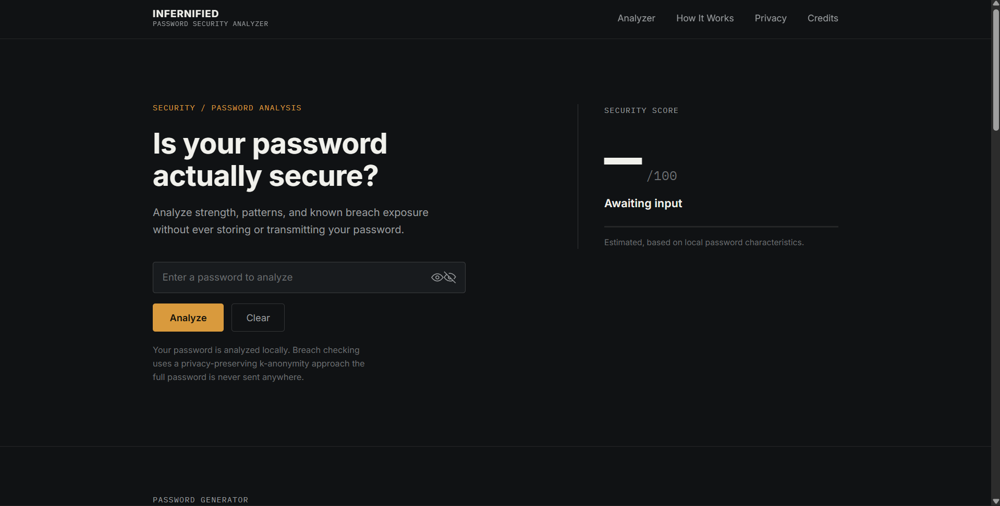

# Infernicated

> A client-side password security analyzer that evaluates password length, composition, patterns, entropy, and known breach exposure. Core analysis runs locally in the browser; the optional breach check uses k-anonymity so your password never leaves your device.




## About

infernicated is a client-side password security analyzer designed to help users understand the characteristics and potential exposure of a password.

It evaluates password length, character composition, common patterns, approximate entropy, and known breach exposure. The application does not have a backend or database. Core analysis runs locally in the browser; only the optional breach check makes a network call, using k-anonymity so the password itself never leaves your device.

Built as a personal project to show that useful password analysis does not require trusting a server with sensitive input.

Built in August 2026.

The optional breach check uses the **Have I Been Pwned Pwned Passwords API** with its k-anonymity range lookup. The password is hashed locally, and only a five-character prefix of the SHA-1 hash is sent to the API. The returned hash suffixes are compared locally in the browser.

## Features

- **Local password analysis**: evaluates password length, uppercase, lowercase, numbers, symbols, repeated characters, sequential patterns, keyboard-style patterns, and common password matches, all locally with no internet connection required.
- **Approximate entropy**: estimates entropy based on password length and the estimated character pool, intended as an educational indicator rather than a guarantee of strength.
- **Security score**: converts several password characteristics into a score from **0–100** with classifications (Very Weak, Weak, Moderate, Strong, Very Strong); the score is a heuristic, not a formal security assessment.
- **Breach exposure check**: optional lookup against the Have I Been Pwned Pwned Passwords API using k-anonymity; the password is hashed locally and only the first five characters of the SHA-1 hash are sent, with suffix comparison done in the browser.
- **Password generator**: configurable generator supporting uppercase, lowercase, numbers, symbols, and custom length, using the browser's `crypto.getRandomValues()` API instead of `Math.random()`; generated passwords are not intentionally stored.
- **Accessibility**: semantic HTML, keyboard navigation, visible focus states, responsive layouts, and reduced-motion support.
- **Responsive design**: CSS Grid and responsive CSS adapt the interface between desktop and mobile layouts.

## Privacy & Security

infernicated was designed around minimizing the amount of sensitive information leaving the browser.

### Password analysis

The main password analysis runs entirely client-side.

The application does not require a database or backend to calculate:

- Password composition
- Patterns
- Approximate entropy
- Security score

### Breach checking

For the optional breach check, the password is hashed locally using SHA-1.

Only the first five characters of that hash are sent to the Have I Been Pwned range API.

The API returns possible matching hash suffixes, which are then compared locally in the browser.

This means the application does not send the complete password or complete password hash to HIBP.

### SHA-1 clarification

SHA-1 is not considered a suitable modern algorithm for password storage or other applications requiring strong collision resistance.

It is used here specifically because the Have I Been Pwned Pwned Passwords API uses SHA-1 hashes for its k-anonymity range lookup.

infernicated does **not** use SHA-1 as a password-storage mechanism.

### Failure handling

If the breach-check request fails or the API is unavailable, the application reports that the breach check is unavailable rather than treating the password as safe.

## How It Works

The application consists entirely of client-side code.

```text
User enters password
        ↓
JavaScript receives input
        ↓
Local password analysis
        ↓
 ┌─────────────────────────────┐
 │ Length                      │
 │ Character composition       │
 │ Repeated patterns           │
 │ Sequential patterns         │
 │ Common passwords            │
 │ Approximate entropy         │
 │ Security score              │
 └─────────────────────────────┘
        ↓
Optional breach check
        ↓
SHA-1 hash generated locally
        ↓
First 5 hash characters sent to HIBP
        ↓
Hash suffixes returned
        ↓
Local comparison
        ↓
Final security report
```

The majority of the application works completely offline. An internet connection is only required for the optional breach exposure check.

## Tech Stack

  

- **HTML5** - page structure and semantic markup
- **CSS3** - responsive layout, CSS Grid, custom properties, animations, and styling
- **Vanilla JavaScript (ES2017+)** - application logic and DOM interaction
- **Web Crypto API** - cryptographic hashing and secure random number generation
- **Fetch API** - communication with the HIBP breach-check endpoint
- **Have I Been Pwned Pwned Passwords API** - breach exposure lookup
- **Inter** - interface typography
- **IBM Plex Mono** - monospace/technical typography

There is:

- No frontend framework
- No backend
- No database
- No build step
- No external JavaScript framework dependencies

## Why This Stack

- **Vanilla JavaScript, no framework** - the app is a single-page analyzer with no routing or state management, so a framework would add build tooling without adding value.
- **No backend or database** - analysis runs in the browser by design, so there is nothing server-side to host or maintain.
- **Web Crypto API** - used for SHA-1 hashing and for `crypto.getRandomValues()` in the password generator, so hashing and randomness are handled by the browser's own secure primitives.
- **Have I Been Pwned API with k-anonymity** - allows an optional breach check where only a five-character hash prefix leaves the browser, keeping the password and its full hash local.
- **CSS Grid and custom properties** - the responsive desktop and mobile layouts are built with plain CSS, so no UI library is needed.
- **Inter and IBM Plex Mono** - clean interface typography with a monospace font for technical output like hashes and scores.

## Project Structure

```text
Infernicated/
│
├── index.html
├── style.css
├── script.js
│
├── assets/
│   └── preview.png
│
├── privacy.html
├── LICENSE
└── README.md
```

### `index.html`

Contains the application's structure and semantic markup.

### `style.css`

Contains the visual design, responsive layouts, typography, animations, and accessibility-related styling.

### `script.js`

Contains the application logic, including:

- Password analysis
- Pattern detection
- Entropy calculation
- Security scoring
- SHA-1 hashing
- HIBP API communication
- Breach result processing
- Password generation
- DOM updates
- Event handling

## Quick Start

### Prerequisites

- A modern browser (Chrome, Firefox, Safari, or Edge)
- Internet access is only required for the optional breach exposure check; the local analysis works offline
- No build tools or installation are required

### Installation

1. Clone the repository:

```bash
git clone https://github.com/p3xz/Infernicated.git
```

2. Move into the project folder:

```bash
cd Infernicated
```

3. Open `index.html` directly in a browser, or serve it with a local development server:

```bash
npx serve .
```

or:

```bash
python3 -m http.server 8080
```

4. Open the local URL provided by your development server in your browser.

## Usage

Serve the project locally and open the provided URL:

```bash
npx serve .
```

Then type a password into the analyzer input to get the local analysis, security score, approximate entropy, and security report. Enable the optional breach check to look up exposure against the Have I Been Pwned database (requires internet access).

## Limitations

infernicated is an educational project and its results have limitations.

- The entropy calculation is an approximation.
- The security score is heuristic rather than a formal security measurement.
- Pattern detection cannot identify every possible password-guessing strategy.
- A password not found in the HIBP database does not guarantee that it has never been compromised.
- SHA-1 is used because it is the hash format required by the HIBP Pwned Passwords API, not as a recommendation for password storage.
- The application is not intended to replace professional security auditing or password-management software.

## Roadmap

- [ ] Add automated tests for scoring and pattern detection
- [ ] Expand the common-password dataset
- [ ] Improve password-pattern analysis
- [ ] Explore more advanced password-strength estimation techniques
- [ ] Add a downloadable analysis report
- [ ] Add a theme toggle while maintaining the existing visual design

## Security Disclaimer

infernicated provides an **educational estimate** of password strength and known breach exposure.

A strong score or a negative breach result does not guarantee that a password is secure.

The application should not be treated as a professional cybersecurity audit, authentication system, or legal/security advice.

## Contributing

Contributions are welcome. Open an issue to discuss a change first, then submit a pull request with a clear description of what you changed and why.

## License

This project is distributed under the MIT License. See the `LICENSE` file for details.

## Credits

### Main Author

**Namish Yadav** - Main Author / Lead Developer

GitHub: [@p3xz](https://github.com/p3xz)

Instagram: [@nam7sh](https://instagram.com/nam7sh)

### Contributors

| Contributor   | Role                         | GitHub                                                 |
| - | - | - |
| Namish Yadav  | Main Author / Lead Developer | [@p3xz](https://github.com/p3xz)       |
| Harshiv Patel | Co-author / Contributor      | [@Harshiv-6967](https://github.com/Harshiv-6967)       |
| Lubna Nawaz   | Co-author / Contributor      | [@Lubnanawaz](https://github.com/Lubnanawaz)           |
| Rushda Khan   | Co-author / Contributor      | [@rushdakhan-byte](https://github.com/rushdakhan-byte) |
